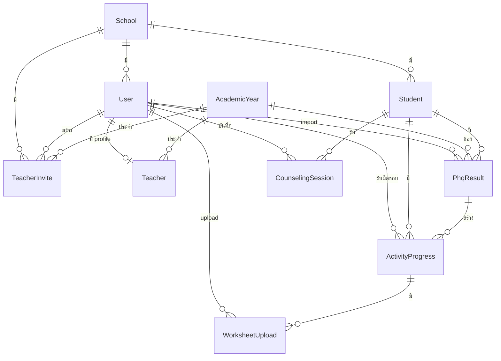

# Database Schema - ระบบครูนางฟ้า (Krunangfah)

## 📊 Entity Relationship Diagram



---

## 📋 Enums

### UserRole

| ค่า             | คำอธิบาย                     |
| --------------- | ---------------------------- |
| `school_admin`  | ครูนางฟ้า (ดูแลทั้งโรงเรียน) |
| `class_teacher` | ครูประจำชั้น (ดูแลเฉพาะห้อง) |

### ProjectRole

| ค่า          | คำอธิบาย  |
| ------------ | --------- |
| `lead`       | ทีมนำ     |
| `care`       | ทีมดูแล   |
| `coordinate` | ทีมประสาน |

### RiskLevel

| ค่า      | คะแนน              | คำอธิบาย                  |
| -------- | ------------------ | ------------------------- |
| `blue`   | 0-4                | ปกติ                      |
| `green`  | 5-9                | เสี่ยงต่ำ (3 กิจกรรม)     |
| `yellow` | 10-14              | เสี่ยงปานกลาง (4 กิจกรรม) |
| `orange` | 15-19              | เสี่ยงสูง (5 กิจกรรม)     |
| `red`    | 20-27 หรือ q9a/q9b | ส่งต่อโรงพยาบาล           |

### ActivityStatus

| ค่า                  | คำอธิบาย       |
| -------------------- | -------------- |
| `locked`             | ยังไม่ปลดล็อค  |
| `in_progress`        | กำลังดำเนินการ |
| `pending_assessment` | รอประเมิน      |
| `completed`          | เสร็จสิ้น      |

### ProblemType

| ค่า        | คำอธิบาย    |
| ---------- | ----------- |
| `internal` | ปัญหาภายใน  |
| `external` | ปัญหาภายนอก |

---

## 🏫 Models

### School (โรงเรียน)

```
┌─────────────────────────────┐
│ schools                     │
├─────────────────────────────┤
│ id        : String (PK)     │
│ name      : String          │
│ province  : String?         │
│ createdAt : DateTime        │
│ updatedAt : DateTime        │
└─────────────────────────────┘
```

**Relations:**

- `1:N` → User (โรงเรียนมีหลาย users)
- `1:N` → Student (โรงเรียนมีหลายนักเรียน)
- `1:N` → TeacherInvite (โรงเรียนมีหลายคำเชิญ)

---

### User (ผู้ใช้งาน)

```
┌─────────────────────────────┐
│ users                       │
├─────────────────────────────┤
│ id            : String (PK) │
│ name          : String?     │
│ email         : String (UQ) │
│ emailVerified : DateTime?   │
│ image         : String?     │
│ password      : String?     │
│ role          : UserRole    │
│ schoolId      : String? (FK)│
│ createdAt     : DateTime    │
│ updatedAt     : DateTime    │
└─────────────────────────────┘
```

**Relations:**

- `N:1` → School (user อยู่ใน 1 โรงเรียน)
- `1:1` → Teacher (user มี 1 profile ครู)
- `1:N` → TeacherInvite (user สร้างหลายคำเชิญ)
- `1:N` → PhqResult (user import หลายผล PHQ)
- `1:N` → ActivityProgress (user รับผิดชอบหลายกิจกรรม)
- `1:N` → WorksheetUpload (user upload หลายใบงาน)
- `1:N` → CounselingSession (user บันทึกหลาย session)

**Unique Constraints:**

- `email` - ไม่ให้ซ้ำกัน

---

### AcademicYear (ปีการศึกษา)

```
┌─────────────────────────────┐
│ academic_years              │
├─────────────────────────────┤
│ id        : String (PK)     │
│ year      : Int             │
│ semester  : Int             │
│ startDate : DateTime        │
│ endDate   : DateTime        │
│ isCurrent : Boolean         │
│ createdAt : DateTime        │
│ updatedAt : DateTime        │
└─────────────────────────────┘
```

**Relations:**

- `1:N` → Teacher (ปีการศึกษามีหลายครู)
- `1:N` → TeacherInvite (ปีการศึกษามีหลายคำเชิญ)
- `1:N` → PhqResult (ปีการศึกษามีหลายผล PHQ)

**Unique Constraints:**

- `[year, semester]` - ไม่ให้ซ้ำ ปี+เทอม

---

### Teacher (ข้อมูลครู)

```
┌─────────────────────────────┐
│ teachers                    │
├─────────────────────────────┤
│ id             : String (PK)│
│ userId         : String (FK)│ ← UNIQUE
│ firstName      : String     │
│ lastName       : String     │
│ age            : Int        │
│ advisoryClass  : String     │
│ academicYearId : String (FK)│
│ schoolRole     : String     │
│ projectRole    : ProjectRole│
│ createdAt      : DateTime   │
│ updatedAt      : DateTime   │
└─────────────────────────────┘
```

**Relations:**

- `1:1` → User (ครู 1 คน = 1 user)
- `N:1` → AcademicYear (ครูประจำปีการศึกษา)

**Note:** ครูไม่มี `schoolId` โดยตรง ใช้ `user.schoolId` แทน

---

### TeacherInvite (คำเชิญครู)

```
┌─────────────────────────────┐
│ teacher_invites             │
├─────────────────────────────┤
│ id             : String (PK)│
│ token          : String (UQ)│
│ email          : String     │
│ firstName      : String     │
│ lastName       : String     │
│ age            : Int        │
│ userRole       : UserRole   │
│ advisoryClass  : String     │
│ academicYearId : String (FK)│
│ schoolId       : String (FK)│
│ schoolRole     : String     │
│ projectRole    : ProjectRole│
│ invitedById    : String (FK)│
│ expiresAt      : DateTime   │
│ acceptedAt     : DateTime?  │
│ createdAt      : DateTime   │
└─────────────────────────────┘
```

**Relations:**

- `N:1` → AcademicYear
- `N:1` → School
- `N:1` → User (ผู้เชิญ)

---

### Student (นักเรียน)

```
┌─────────────────────────────┐
│ students                    │
├─────────────────────────────┤
│ id        : String (PK)     │
│ studentId : String          │ ← Required
│ firstName : String          │
│ lastName  : String          │
│ class     : String          │
│ schoolId  : String (FK)     │
│ createdAt : DateTime        │
│ updatedAt : DateTime        │
└─────────────────────────────┘
```

**Relations:**

- `N:1` → School (นักเรียนอยู่ใน 1 โรงเรียน)
- `1:N` → PhqResult (นักเรียนมีหลายผล PHQ)
- `1:N` → ActivityProgress (นักเรียนมีหลายกิจกรรม)
- `1:N` → CounselingSession (นักเรียนมีหลาย session)

**Unique Constraints:**

- `[studentId, schoolId]` - รหัสนักเรียน+โรงเรียน ห้ามซ้ำ

---

### PhqResult (ผลการประเมิน PHQ-A)

```
┌─────────────────────────────────┐
│ phq_results                     │
├─────────────────────────────────┤
│ id                : String (PK) │
│ studentId         : String (FK) │
│ academicYearId    : String (FK) │
│ importedById      : String (FK) │
│ assessmentRound   : Int         │
│ q1-q9             : Int (0-3)   │
│ q9a, q9b          : Boolean     │
│ totalScore        : Int         │
│ riskLevel         : RiskLevel   │
│ referredToHospital: Boolean     │
│ createdAt         : DateTime    │
└─────────────────────────────────┘
```

**Relations:**

- `N:1` → Student
- `N:1` → AcademicYear
- `N:1` → User (ผู้ import)
- `1:N` → ActivityProgress

**Unique Constraints:**

- `[studentId, academicYearId, assessmentRound]` - ป้องกันประเมินซ้ำ

---

### ActivityProgress (ความคืบหน้ากิจกรรม)

```
┌─────────────────────────────────┐
│ activity_progress               │
├─────────────────────────────────┤
│ id               : String (PK)  │
│ studentId        : String (FK)  │
│ phqResultId      : String (FK)  │
│ activityNumber   : Int (1-5)    │
│ status           : ActivityStatus│
│ unlockedAt       : DateTime?    │
│ completedAt      : DateTime?    │
│ scheduledDate    : DateTime?    │
│ teacherId        : String? (FK) │
│ teacherNotes     : String?      │
│ internalProblems : String?      │
│ externalProblems : String?      │
│ problemType      : ProblemType? │
│ assessedAt       : DateTime?    │
│ createdAt        : DateTime     │
│ updatedAt        : DateTime     │
└─────────────────────────────────┘
```

**Relations:**

- `N:1` → Student
- `N:1` → PhqResult
- `N:1` → User (ครูผู้รับผิดชอบ)
- `1:N` → WorksheetUpload

**Unique Constraints:**

- `[studentId, phqResultId, activityNumber]` - ป้องกันกิจกรรมซ้ำ

**Business Logic:**
| Risk Level | กิจกรรม |
|------------|---------|
| green | 1, 2, 5 (3 records) |
| yellow | 1, 2, 3, 5 (4 records) |
| orange | 1, 2, 3, 4, 5 (5 records) |

---

### WorksheetUpload (ใบงาน)

```
┌─────────────────────────────────┐
│ worksheet_uploads               │
├─────────────────────────────────┤
│ id                 : String (PK)│
│ activityProgressId : String (FK)│
│ fileName           : String     │
│ fileUrl            : String     │
│ fileType           : String     │
│ fileSize           : Int        │
│ uploadedById       : String (FK)│
│ uploadedAt         : DateTime   │
└─────────────────────────────────┘
```

**Relations:**

- `N:1` → ActivityProgress
- `N:1` → User (ผู้ upload)

---

### CounselingSession (การให้คำปรึกษา)

```
┌─────────────────────────────────┐
│ counseling_sessions             │
├─────────────────────────────────┤
│ id            : String (PK)     │
│ studentId     : String (FK)     │
│ sessionNumber : Int             │
│ sessionDate   : DateTime        │
│ counselorName : String          │
│ summary       : Text            │
│ createdById   : String (FK)     │
│ createdAt     : DateTime        │
│ updatedAt     : DateTime        │
└─────────────────────────────────┘
```

**Relations:**

- `N:1` → Student
- `N:1` → User (ผู้บันทึก)

---

## 🔗 Relationship Summary

| From             | To                | Type | Description               |
| ---------------- | ----------------- | ---- | ------------------------- |
| School           | User              | 1:N  | โรงเรียนมีหลาย users      |
| School           | Student           | 1:N  | โรงเรียนมีหลายนักเรียน    |
| School           | TeacherInvite     | 1:N  | โรงเรียนมีหลายคำเชิญ      |
| User             | Teacher           | 1:1  | user มี 1 profile ครู     |
| User             | TeacherInvite     | 1:N  | user สร้างหลายคำเชิญ      |
| User             | PhqResult         | 1:N  | user import หลายผล        |
| User             | ActivityProgress  | 1:N  | user รับผิดชอบหลายกิจกรรม |
| User             | WorksheetUpload   | 1:N  | user upload หลายใบงาน     |
| User             | CounselingSession | 1:N  | user บันทึกหลาย session   |
| AcademicYear     | Teacher           | 1:N  | ปีการศึกษามีหลายครู       |
| AcademicYear     | TeacherInvite     | 1:N  | ปีการศึกษามีหลายคำเชิญ    |
| AcademicYear     | PhqResult         | 1:N  | ปีการศึกษามีหลายผล        |
| Student          | PhqResult         | 1:N  | นักเรียนมีหลายผล PHQ      |
| Student          | ActivityProgress  | 1:N  | นักเรียนมีหลายกิจกรรม     |
| Student          | CounselingSession | 1:N  | นักเรียนมีหลาย session    |
| PhqResult        | ActivityProgress  | 1:N  | ผล PHQ สร้างหลายกิจกรรม   |
| ActivityProgress | WorksheetUpload   | 1:N  | กิจกรรมมีหลายใบงาน        |

---

## 🔒 Unique Constraints Summary

| Table             | Fields                                       | Purpose                    |
| ----------------- | -------------------------------------------- | -------------------------- |
| users             | email                                        | ป้องกัน email ซ้ำ          |
| teachers          | userId                                       | 1 user = 1 teacher profile |
| teacher_invites   | token                                        | token ไม่ซ้ำ               |
| academic_years    | [year, semester]                             | ป้องกันปี+เทอมซ้ำ          |
| students          | [studentId, schoolId]                        | รหัสนักเรียน+โรงเรียน      |
| phq_results       | [studentId, academicYearId, assessmentRound] | ป้องกันประเมินซ้ำ          |
| activity_progress | [studentId, phqResultId, activityNumber]     | ป้องกันกิจกรรมซ้ำ          |

---

## 🗑️ Cascade Delete

| Parent           | Child             | OnDelete |
| ---------------- | ----------------- | -------- |
| User             | Teacher           | Cascade  |
| Student          | PhqResult         | Cascade  |
| Student          | ActivityProgress  | Cascade  |
| Student          | CounselingSession | Cascade  |
| ActivityProgress | WorksheetUpload   | Cascade  |

---

## 📈 Data Flow

```
1. สร้างโรงเรียน (School)
   ↓
2. ลงทะเบียนครู (User + Teacher Profile)
   ↓
3. Import นักเรียน + PHQ-A (Student + PhqResult)
   ↓
4. สร้างกิจกรรมอัตโนมัติ (ActivityProgress)
   ↓
5. ทำกิจกรรม + อัปโหลดใบงาน (WorksheetUpload)
   ↓
6. บันทึกการให้คำปรึกษา (CounselingSession)
```
